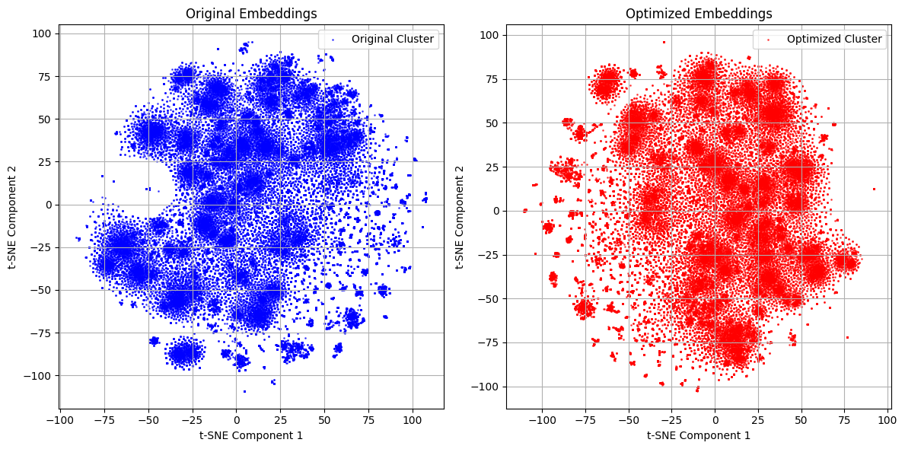

# Embedding-Based Retrieval System

## Step 1: Find Embeddings

### Dataset Description

The dataset consists of 80,000 Steam games. Each entry includes the game's name, categories, user reviews, release date, developer, publisher, and price. The data was cleaned to remove missing values and standardized pricing information. A combined text field was created by concatenating relevant attributes to facilitate embedding generation.

### Embedding Generation Process

Embeddings were generated using the pre-trained `all-MiniLM-L6-v2` model from SentenceTransformers. Each game's combined text was encoded into a high-dimensional vector. To enhance these embeddings, a deep denoising autoencoder was implemented using PyTorch. The autoencoder reduces the embedding dimension from 384 to 128, improving their significance for the specific dataset.


### Training Process

The autoencoder was trained using Mean Squared Error (MSE) as the loss function. MSE measures the average squared difference between the input and reconstructed embeddings, ensuring the model accurately captures essential features. The optimizer used was Adam with a learning rate of 0.001. Training was conducted for 10 epochs on a GPU-enabled device to optimize performance.

\[
\text{Loss} = \frac{1}{n} \sum_{i=1}^{n} (x_i - \hat{x}_i)^2
\]

## Step 2: Visualize Your Embeddings

### Figures

The provided visualization shows the t-SNE projections of both the pre-trained and tuned embeddings for the Steam Games dataset. On the left, we see the original (pre-trained) embeddings projected onto a 2D space, while on the right, the optimized (tuned) embeddings after fine-tuning with the autoencoder are displayed.

### Discussion

In both figures, distinct clusters are visible, suggesting some form of natural grouping within the dataset based on the embeddings. However, the optimized embeddings do not differ significantly from the pre-trained ones in terms of overall structure and clustering. The clusters in both plots appear in similar regions and maintain similar density and separation patterns.

This similarity indicates that the autoencoder did not drastically alter the spatial relationships in the embedding space. Instead, it likely improved the embeddings' representation for retrieval tasks without changing the underlying structure. Thus, the clusters are still organized in ways that reflect inherent similarities in the dataset, likely based on attributes like genre, game categories, or developer. Further investigation into each cluster's content could reveal more specific insights into how games are grouped according to these characteristics.




## Step 3: Test the Search System

### Query Results

The search system was tested using three queries to evaluate its retrieval performance. Here are the results for each query.

---

#### Query 1: "2D platformer with horror elements"

**Results:**
1. Gremlins, Inc. – Card Game, Print & Play Set - $4.99
2. Jewels of the Mysterious Woodland - $3.99
3. GameGuru - Abandoned Apartment Pack - $29.99
4. The Legacy Games Demo - free
5. Monster Hunter World: Iceborne - MHW:I Room Decor: Intimate Decor Set - $9.99
6. Monster Hunter World: Iceborne - MHW:I Monster Figure: Kirin - $2.99
7. Dead Space™ 3 Bot Accelerator - $4.99
8. Mimicry - $4.99
9. Block Granny Horror Survival - $2.99
10. Monster Hunter World: Iceborne - MHW:I Monster Figure: Girros & Great Girros - $2.99

---

#### Query 2: "2D platformer with horror elements and user reviews"

**Results:**
1. German Fortress 3D - $2.99
2. Call of Duty®: Black Ops III - Zombies Chronicles - $29.99
3. Sweet Dungeon - $1.99

---

#### Query 3: "good card playing mahjong game"

**Results:**
1. Classic Card Game Mahjong - $1.99
2. Mahjong Solitaire - Ultimate Video Game Pack 1 - $1.99
3. Sweet Candy Mahjong - $2.99
4. The Mahjong Huntress - $4.99
5. That's Mahjong! - $0.99

---

### Summary of Test Results

1. **Test with 10 Results:** The system returned a mix of relevant and loosely related games, with some noise in genre-specific details.
2. **Test with Fewer than 10 Results:** The system narrowed results significantly, showing some ability to match criteria but struggled to balance multiple specifics in the query.
3. **Non-Obvious Results:** The system provided highly relevant results when the query had a well-defined, niche topic, such as Mahjong.

These results suggest that the system performs best with well-defined, genre-specific queries. However, complex queries with multiple criteria (such as genre + review filters) may still require optimization for better precision.

## Step 4: Make It Nicer - MLOps Specialist

### Model Setup and Dynamic Deployment

The FastAPI application includes a `/setup-model` endpoint that allows users to select and train an embedding model from a predefined list (e.g., `MiniLM-L6-v2`, `MPNet-base-v2`, `BERT-base-NLI`). This endpoint checks if the chosen model’s parameters are already saved on the server. If they are, it raises an error indicating that the model is already available. Otherwise, it initiates training with an autoencoder, which fine-tunes the model’s embeddings specifically for the Steam games dataset, enhancing their relevance and compactness. By saving only the optimized parameters (e.g., as `.pth` files), we enable efficient storage management and easy model switching without uploading large files to GitHub.

### Fast Search and Efficient Embedding Storage

The `/search` endpoint enables users to perform searches on the Steam games dataset. By providing a search term (`query`), the number of results (`top_k`), and the model name for embedding generation, users can retrieve relevant games based on cosine similarity with the stored embeddings. The system uses a vector database (`pgvector`) to store and manage embeddings, allowing for efficient similarity searches across high-dimensional data. The `SearchService` class handles embedding generation for the query and performs a fast cosine similarity search, ensuring that results are returned quickly, even with large datasets.

### Explanation of the Code Structure

The following code provides a simplified overview of the main functions:

```python
# FastAPI Router for Model Setup
@router.post("/setup-model", response_model=SetupModelResponse, summary="Train the needed model")
async def setup_model(
    request: SetupModelRequest, db: AsyncSession = Depends(get_db)
) -> SetupModelResponse:
    """
    Train the needed model for the application.

    Args:
    - request: SetupModelRequest - The model to be trained.
    - db: AsyncSession - The database session.

    Returns:
    - SetupModelResponse - The response message.
    """
    if f"{settings.sentence_transformer_models[request.model][0]}.pth" in os.listdir(settings.embedding_models_path):
        raise HTTPException(status_code=400, detail=f"Model {request.model} is already downloaded.")

    elif request.model in settings.sentence_transformer_models.keys():
        train_autoencoder(request.model)
    else:
        raise HTTPException(status_code=400, detail=f"Model {request.model} not found.")

    return SetupModelResponse(message=f"Model {request.model} is now downloaded.")

# FastAPI Router for Game Search
@router.get("/search", response_model=List[SteamGameResponse], summary="Search for Steam Games")
async def search_games(
    query: str = Query(..., description="The search term to look for in the game database."),
    top_k: int = Query(10, description="The number of top results to return."),
    model_name: str = Query("MiniLM-L6-v2", description="The model to use for generating embeddings."),
    db: AsyncSession = Depends(get_db),
) -> List[SteamGameResponse]:
    """
    Search for Steam games based on a query string.

    Args:
    - query (str): The search term to look for in the game database.
    - top_k (int): The number of top results to return.
    - model_name (str): The model to use for generating embeddings.

    Returns:
    - List[SteamGameResponse]: A list of Steam games that match the search criteria.
    """
    if model_name not in settings.sentence_transformer_models.keys():
        raise HTTPException(status_code=400, detail=f"Model {model_name} not found.")

    search_service = SearchService(settings.sentence_transformer_models[model_name])
    games = await search_service.search_games(query, top_k, db)

    if not games:
        raise HTTPException(status_code=404, detail="No games found.")

    return games
```
---
